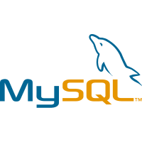

# MySql

---

## Mysql存储引擎

* 常用的存储引擎：

    1. MYISAM：非事物的存储引擎，不支持事物
    2. CSV存储引擎：以csv格式文件保存数据的非事物型的存储引擎
    3. Archive：只允许查询和新增数据而不允许修改的非事物存储引擎
    4. Memory：内存中的非事物型的存储引擎
    5. NDB：mysql集群所使用的内存型事物存储引擎
    
* InnoDB：

    **最常用的事物型存储引擎，也是5.6之后的默认存储引擎**
    **在5.5之后的版本支持在线修改表结构的操作，是不会阻塞对表的写操作，之前是不行的，之前是	具有排它锁的**
