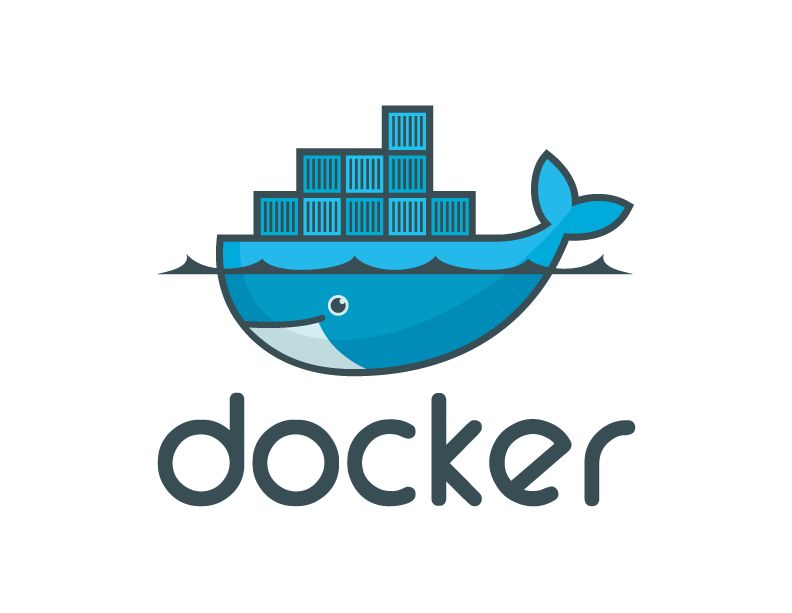
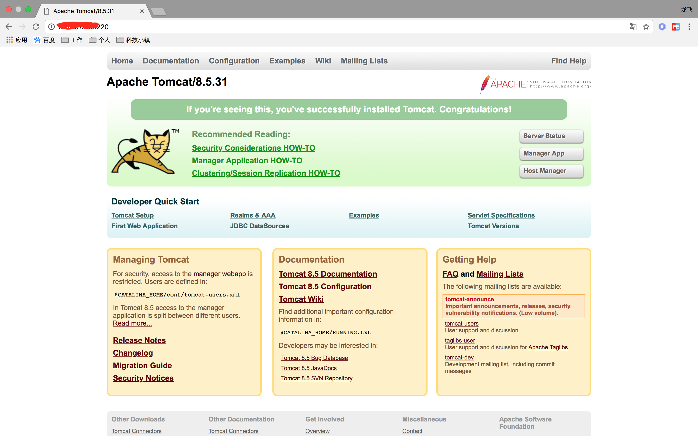
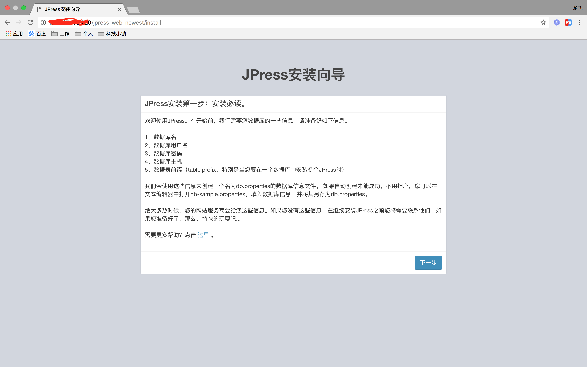
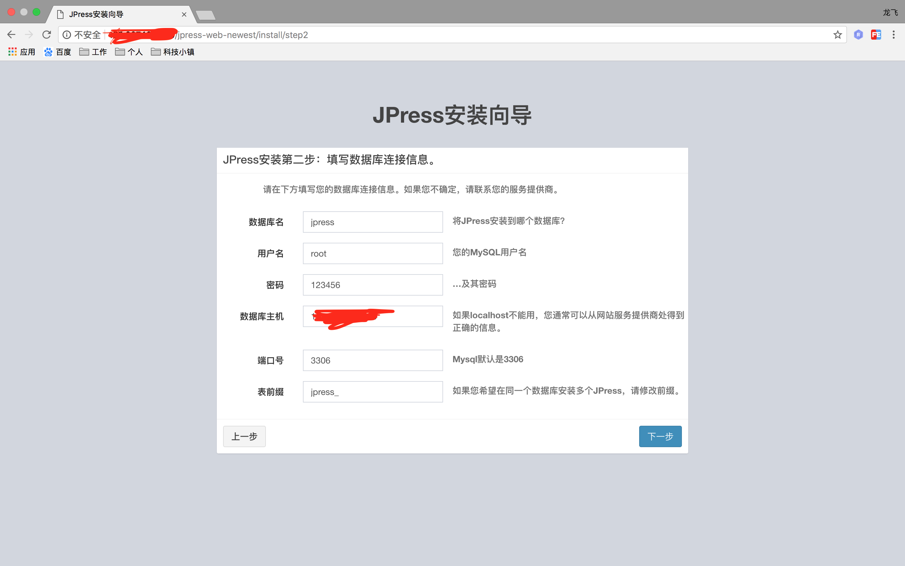
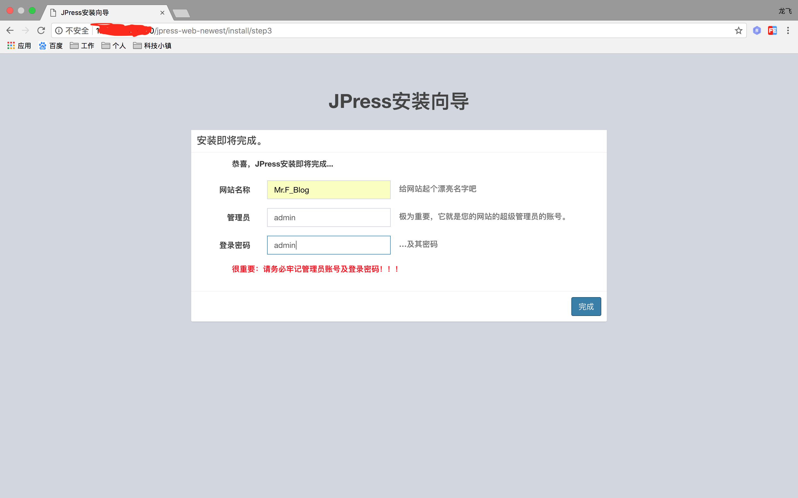
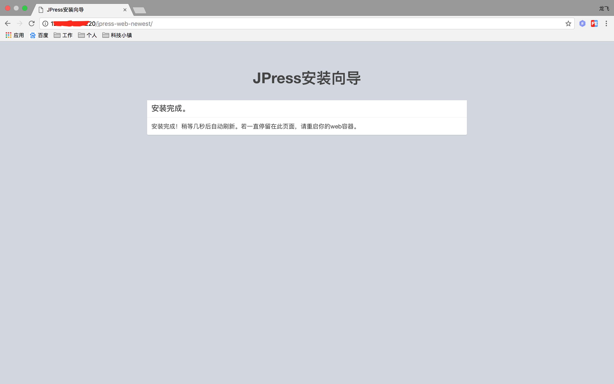
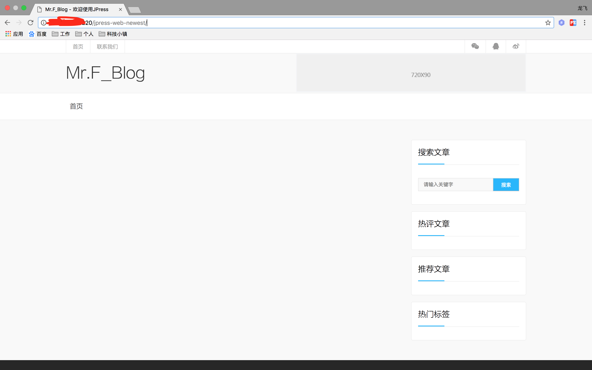

# Docker Compose

---

**
DockerCompose是官方提供的「服务编排」工具。通过Dockerfile可以进行制作我们需要的镜像，来定义当我们需要的
容器服务。当我们需要定义多个容器服务的时候，比如来部署我们的微服务架构的时候，就可以使用DockerCompose
来进行「服务编排」
**

## 安装DockerCompose

**
一般在Mac和Windows下安装Docker以后是包含DockerCompose的，不用单独安装，但liunx下需要单独安装DockerCompose
**

* 使用yum安装DockerCompose

```
$ sudo yum -y install docker-compose
```

* 卸载yum安装的DockerCompose

```
$ sudo yum remove docker-compose
```

## docker-compose.yml文件

**
在docker-compose.ymu文件中定义各个容器之间依赖关系，进行服务编排，使用docker-compose中的指令对各个容器进行相关操作，
比如image的来源是从registry进行获取还是使用Dockerfile进行制作、外部端口与容器内部端口映射、image启动时生成容器需要
指定的环境变量以及容器的挂载卷等等操作，都在docker-compose.yml文件中进行指令定义，可以将这些指令理解为类似于使用单独
「$ docker run」的操作命令，只不过将这些指令定义在了docker-compose.yml中
**

## demo

**
使用开源的Jpress做docker-compose的demo示例，使用从GitHub上获取的jpress-web-newest.war，用到的Docker image
包括Mysql、Tomcat、Nginx，可以从Docker Hub上进行获取，也可以从国内的其他镜像中心进行获取
**

**
jpress-web-newest.war的
Github地址:[https://github.com/JpressProjects/jpress/tree/alpha/wars](https://github.com/JpressProjects/jpress/tree/alpha/wars)
**

1.创建一个干净的目录结构，作为docker-compose.yml的上下文

```
$ mkdir docker_learn
```

2.创建Mysql、Nginx、Tomcat的各个目录，在各个目录中，会编写简单的Dockerfile文件，各个目录作为各个Dockerfile的上下文

```
$ cd docker_learn
$ mkdir mysql nginx tomcat
```

3.进入Mysql目录，创建Dockerfile文件以及data目录，data目录作为Mysql的挂载卷，管理Mysql的数据，使用Dockerfile进行image的生成

```
$ cd /docker_learn/mysql
$ touch Dockerfile
$ mkdir data
```

>Dockerfile文件内容:

```
FROM mysql:5.7
ENV port 3306
EXPOSE ${port}
```

4.进入nginx目录，创建Dockerfile文件以及data目录，data目录作为Nginx的挂载卷，管理Nginx的数据，使用Dockerfile进行image的生成

```
$ cd /docker_learn/nginx
$ touch Dockerfile
$ mkdir data
$ cd data
$ touch learn.conf
```

>Dockerfile文件内容:

```
FROM nginx:latest
COPY ./data/learn.conf /etc/nginx/conf.d/learn.conf
```

>learn.conf文件内容

```
server{

    listen  80;
    server_name 服务器外网或本机ip;
    access_log  /var/log/nginx/learn.access.log;
    error_log   /var/log/nginx/learn.error.log;
    location / {

        proxy_pass  http://服务器外网或本机ip:8080;

    }
}
```

5.进入tomcat目录，创建Dockerfile文件以及data目录，data目录作为Tomcat的挂载卷，管理Tomcat的数据，使用Dockerfile进行image的生成

```
$ cd /docker_learn/tomcat
$ touch Dockerfile
$ mkdir data
$ cd data
$ wget https://github.com/JpressProjects/jpress/raw/alpha/wars/jpress-web-newest.war
```

>Dockerfile文件内容:

```
FROM tomcat:latest
COPY ./data/jpress-web-newest.war /usr/local/tomcat/webapps/
```

6.回到docker-compose的上下文目录，创建docker-compose.yml文件

```
$ cd /docker_learn
$ touch docker-compose.yml
```

>docker-compose.yml内容

```
version: '2'

services: 
  database:
    build: ./mysql
    volumes: 
      - ./mysql/data:/var/lib/mysql
    ports: 
      - "3306:3306"
    environment:
      MYSQL_ROOT_PASSWORD: 123456
      MYSQL_DATABASE: jpress

  nginx:
    build: ./nginx
    volumes: 
      - ./nginx/data:/etc/nginx/conf.d
    ports:
      - "80:80"

  tomcat:
    build: ./tomcat
    volumes: 
      - ./tomcat/data:/var/lib/tomcat7/webapps
    ports:
      - "8080:8080"
    depends_on: 
      - nginx
```

7.定义好之后在当前目录下使用docker-compose

>-f 表示指定执行的是docker-compose.yml文件，存在多个文件时进行指定，只存在单个文件的情况下可以不添加

>up 启动image并且运行container

>-d 后台启动

```
$ docker-compose -f docker-compose.yml up -d
```

8.这时候访问本机的ip，看看不会不跳转到Tomcat界面

>访问成功，说明Nginx配置已经生效



9.访问的Jpress项目，在tomcat目录下的Dockerfile中，把war文件已经copy到了Tomcat的webapps目录，在ip后面追加war名称，进行项目访问

>访问地址：hostIp/jpress-web-newest，如果跳转到了以下页面，说明成功



10.点击下一步，配置数据库，配置完后，点击下一步，验证数据库是否生效

>数据库名称，我们在docker-compose.yml中指定好的，jpress

>root的密码，我在docker-compose.yml中指定好的，123456

>数据库主机，填写本机IP地址，端口号3006



11.出现以下页面说明数据库也已经生效，配置下Jpress的基本信息



>点击完成



12.按照提示，重启我们的Jpress服务

>首先docker ps 查看正在运行的容器，找到tomcat容器的containerId
>重启docker restart 刚才记录的容器Id
>重新进行访问，访问地址：hostIp/jpress-web-newest，如果跳转到了以下页面，说明成功

```
$ docker ps
$ docker restart tomcat_containerId
```



## 资源推荐

* 慕课网使用Jpress作为Dockerfile的demo，上面的demo是在基础上配置了docker-compose

>视频地址：[https://www.imooc.com/learn/824](https://www.imooc.com/learn/824)

* 慕课网Docker入门

>视频地址：[https://www.imooc.com/learn/867](https://www.imooc.com/learn/867)