# GitBook服务安装

---

## Mac OS

* 下载Node.js，官方地址：[https://nodejs.org/zh-cn/download/](https://nodejs.org/zh-cn/download/)，选择下载

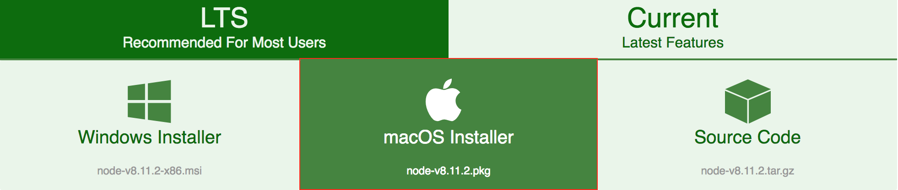

* 安装完成之后，在命令行使用npm安装GitBook

```bash
$ npm install gitbook-cli -g
```

* 查看GitBook版本

> 第一次的时候需要等待GitBook的初始化

```bash
$ gitbook -V
```

## Windows

* 下载Node.js，官方地址：[https://nodejs.org/zh-cn/download/](https://nodejs.org/zh-cn/download/)，选择下载

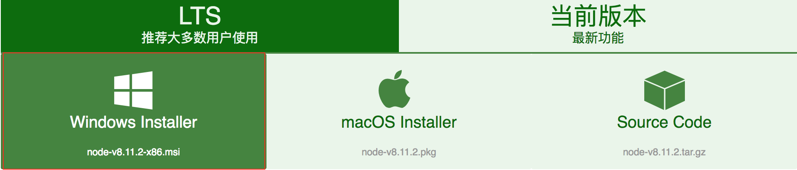

* 安装完成之后，在GitBash中使用npm安装GitBook

> Git for Windows 提供了一个仿真环境，可以从windows命令行执行git命令。,在这个仿真环境下，使用git命令跟linux 和UNIX是一样的。

```bash
$ npm install gitbook-cli -g
```

* 查看GitBook版本

> 第一次的时候需要等待GitBook的初始化

```bash
gitbook -V
```

## CentOS

* 下载Node.js，官方地址：[https://nodejs.org/zh-cn/download/](https://nodejs.org/zh-cn/download/)，选择下载，或者右键复制地址，
在CentOS中使用wget进行下载

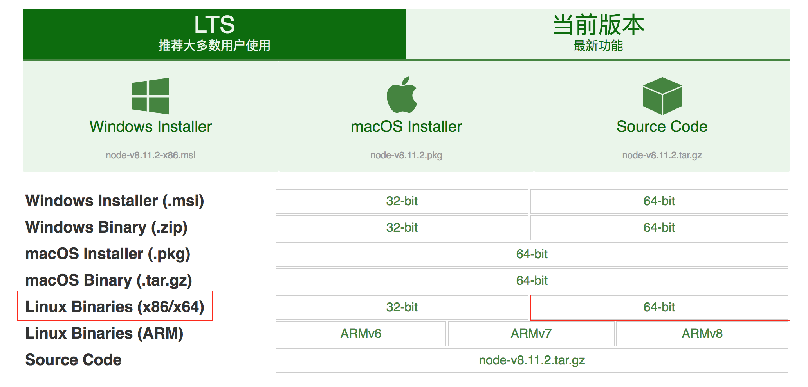

> 使用wget

```bash
$ wget https://nodejs.org/dist/v8.11.2/node-v8.11.2-linux-x64.tar.xz
```

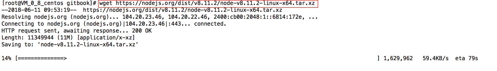

* 解压.xz文件

> node-v8.11.2-linux-x64.tar.xz文件解压后会变成node-v8.11.2-linux-x64.tar文件

```bash
$ xz -d node-v8.11.2-linux-x64.tar.xz
```

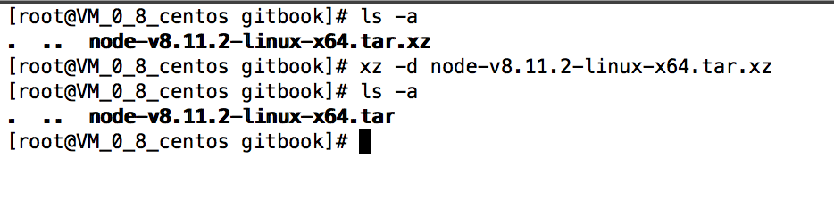

* 解压.tar 文件

```
$ tar -xvf node-v8.11.2-linux-x64.tar
```

* 安装已经完成，到node解压文件中的bin目录执行./node -v 验证是否可以查看当前node版本

> 我们要使用npm来安装GitBook，但是bin目录下同样执行 ./npm 的时候会报一个错误，这个错误就是提示我们需要将node配置全局，
>什么意思呢，如果不将node设置为全局的话，出了bin目录，就无法执行node的命令

```bash
$ cd /gitbook/node-v8.11.2-linux-x64/bin

$ ./node -v
```

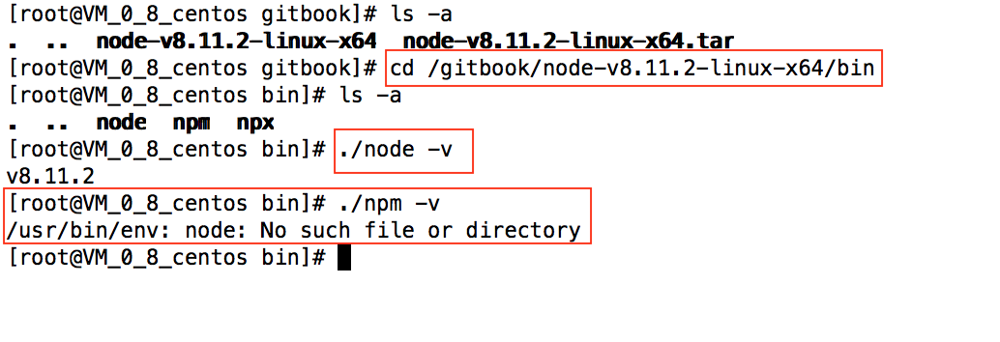

* 将node设置为全局

> 在bin目录下可以使用pwd输出bin目录的绝对路径，我的node的bin目录的绝对路径为：/gitbook/node-v8.11.2-linux-x64/bin/，
> 设置全局后，到任意目录执行node -v，查看配置是否生效

```bash
$ sudo ln -s /gitbook/node-v8.11.2-linux-x64/bin/node /usr/local/bin/

$ cd ../

$ node -v
```

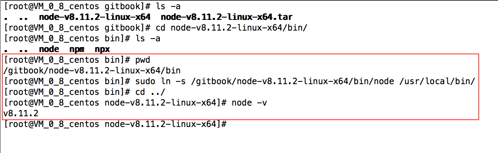

* 将npm设置为全局

> 将node设置为全局之后再回到node的bin目录中查看npm版本

```bash
$ cd /gitbook/node-v8.11.2-linux-x64/bin

$ ./npm -v
```

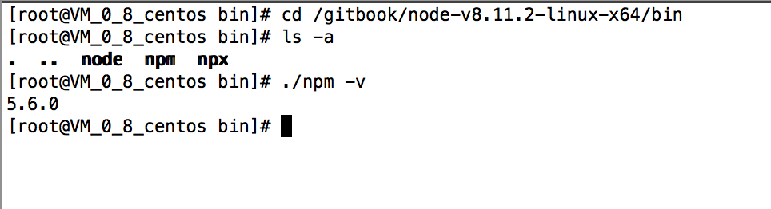

**
这个时候就不会出现刚才的错误了，原因是因为第一次node没有设置为全局，但是npm是需要用到node的，在它使用node的时候找不到，
就和使用java时没有配置环境变量一样
**

> 为了方便，将npm也是设置为全局，然后到任意目录下执行npm -v

```bash
$ sudo ln -s /gitbook/node-v8.11.2-linux-x64/bin/npm /usr/local/bin/

$ cd ../

$ npm -v
```

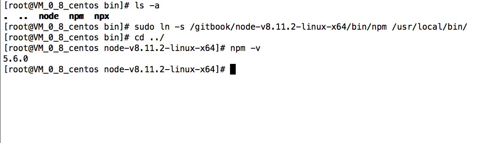

* 使用npm安装GitBook

```bash
$ npm install gitbook-cli -g
```

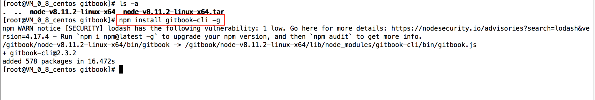

* 将GitBook配置全局

```bash
$ sudo ln -s /gitbook/node-v8.11.2-linux-x64/bin/gitbook /usr/local/bin/
```

* 查看GitBook版本

> 第一次的时候需要等待GitBook的初始化

```bash
$ gitbook -V
```

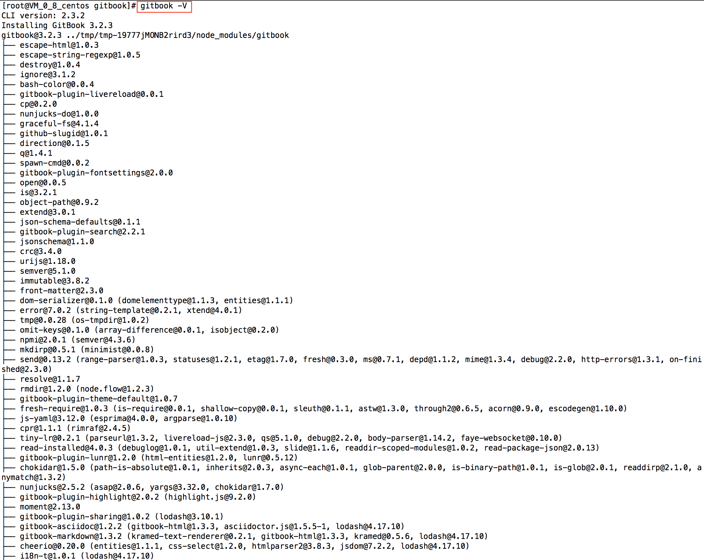

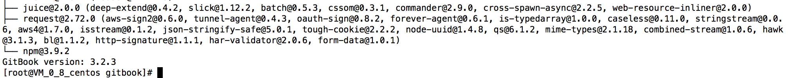