# 使用GitBook

---

## 创建GitBook项目

> 打开命令行，在指定的目录下创建一个GitBook项目，我是在桌面

```bash
$ mkdir my_gitbook_demo

$ cd my_gitbook_demo

$ gitbook init
```

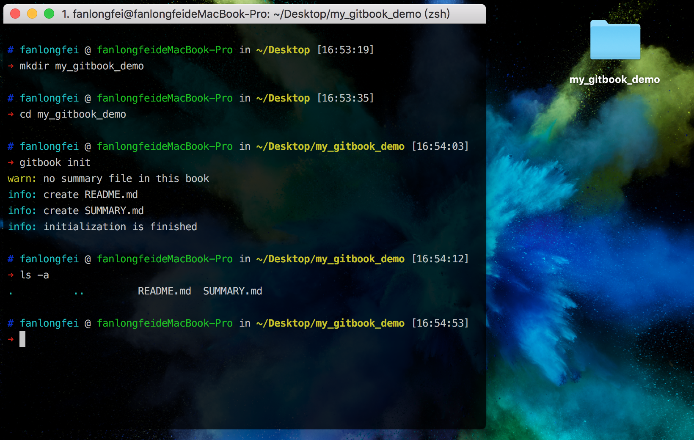

**
执行 $gitbook init后会生成「README.md」文件和「SUMMARY.md」文件，「README.md」文件是整个GitBook的简介，作用和GitHub上的「README.md」文件
作用是一样，「SUMMARY.md」文件是整个GitBook书籍的目录结构
**

## 运行GitBook项目

> 可以在项目目录下运行，也可以在其他的目录下运行GitBook项目，只要指定GitBook的项目目录即可

* 项目目录

```bash
$ gitbook serve
或
$ gitbook serve ./
```

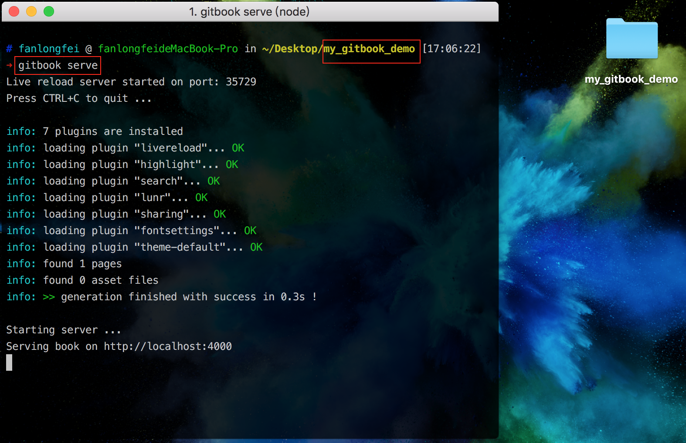

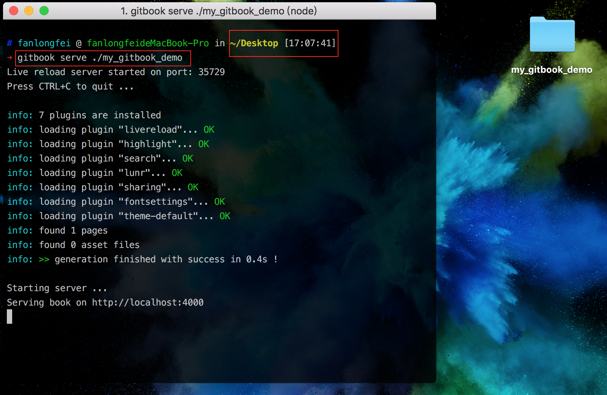

* 启动后可以进行访问，GitBook默认的端口号是4000

> 在浏览器的地址栏输入localhost:4000进行访问

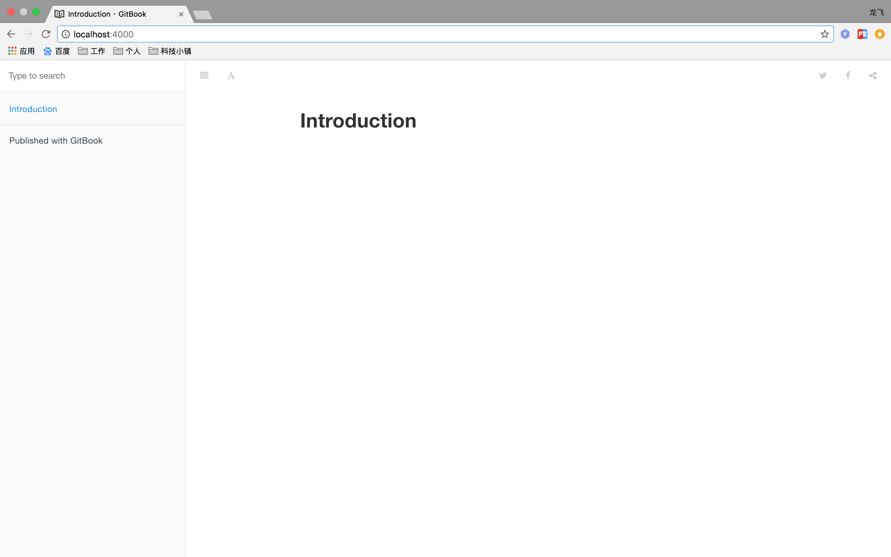

**
基本的项目雏形已经OK了，现在我们需要来根据自己的需求进行GitBook项目的整理
**

## 编写GitBook项目

**
对于GitBook的编写有很多的编辑器可以使用，这里的demo使用IntelliJIDEA进行GitBook文档项目的编写
**

* 使用IntelliJIDEA打开创建的GitBook项目

> 打开后会发现项目中多了一个「_book」文件夹，这个文件夹是GitBook项目启动后生成的HTML静态文件

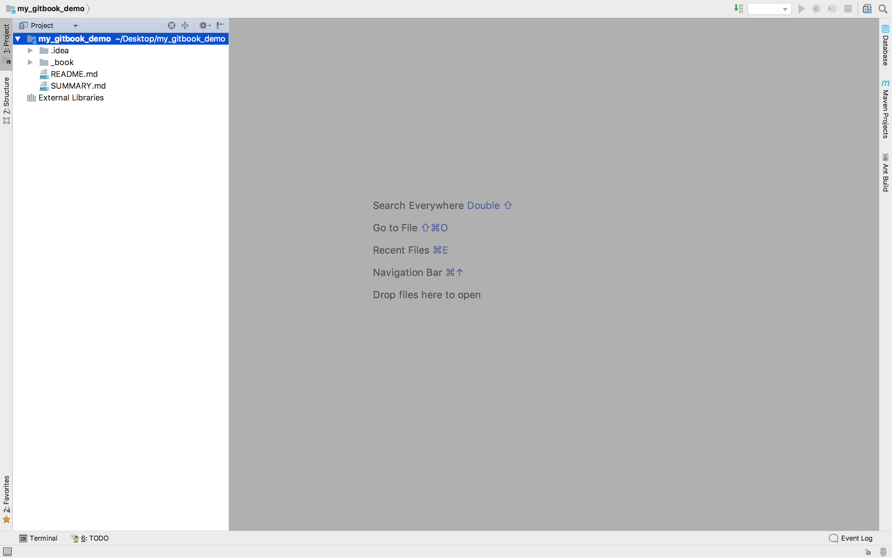

* 编辑GitBook目录结构

**
项目启动后的首页指向GitBook中的「README.md」文件，这里面的内容是'介绍'，类似于一本书中的「简介」和「前言」，
首页中左侧的菜单栏对应GitBook项目中的「SUMMARY.md」文件，在项目中的「SUMMARY.md」中定义的目录结构也是可以分层的（一级菜单、二级菜单），
编辑「SUMMARY.md」的时候，方括号里定义的是菜单的名称，后面的小括号指向的是我们创建的.md文件的地址
**

> 1.自定义目录结构

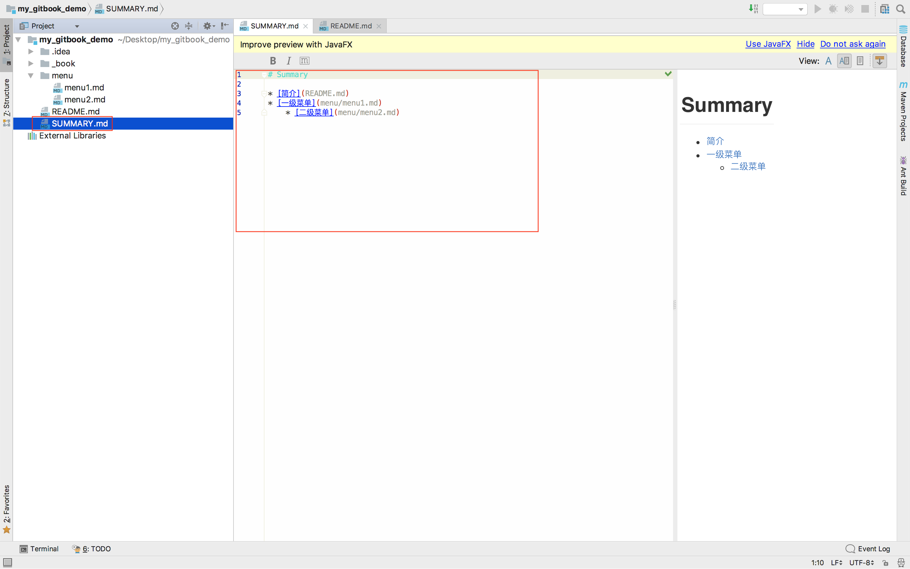

> 2.编辑书籍简介

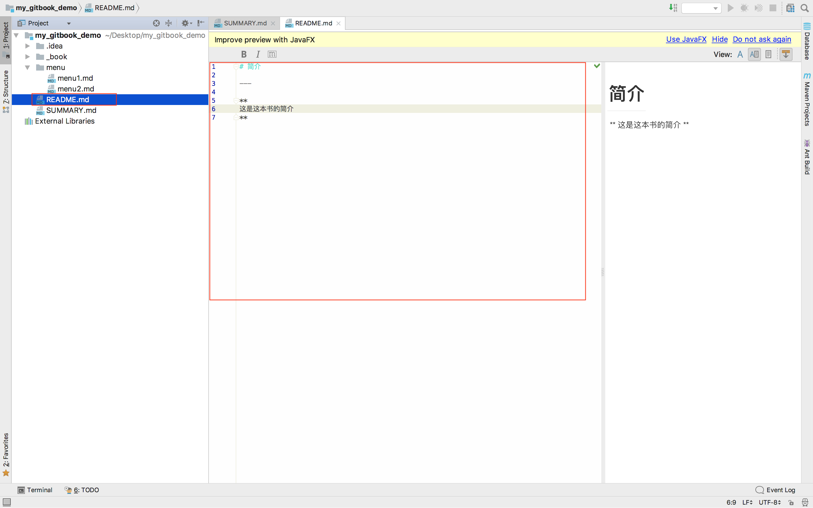

> 3.启动项目，查看效果

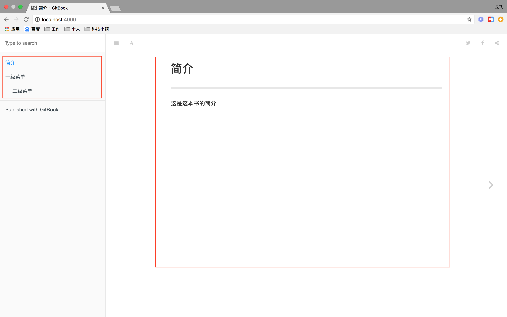

* 编写GitBook内容

**
GitBook中使用的语法，使用标准的MarkDown语法即可，如果不熟悉MarkDown的话，可以先去了解一下
MarkDown，而且GitBook项目是自动支持热部署的，什么意思，就在启动GitBook服务后，修改GitBook
内容后项目可以自动重启，页面会进行自动刷新
**

**
MarkDown资源：
**

[GitBook简介-->GitBook资源](gitbook1.md)

* 在GitBook中使用插件

**
GitBook提供了许多丰富的插件，来帮助我们更好的制作 文档/书籍 ，插件的使用方法是在GitBook项目中
创建「book.json」文件，「book.json」文件放置GitBook项目的根目录，在「book.json」文件中定义
以及配置GitBook插件，「book.json」是以JSON的语法来进行编写，官方是提供插件库的，插件的资源在
[GitBook简介-->GitBook资源](gitbook1.md)已经罗列
**

**
将「book.json」定义完成之后，不能直接启动项目，需要将「book.json」中使用的插件进行安装，否则
GitBook会提示你需要安装在「book.json」中使用的插件
**

> 1.示例，创建「book.json」文件，替换原本GitBook的搜索插件，使用支持高亮显示搜索的插件'search-plus'，使用
> 'search-plus'时，需要将'lunr'插件和'search'插件禁用

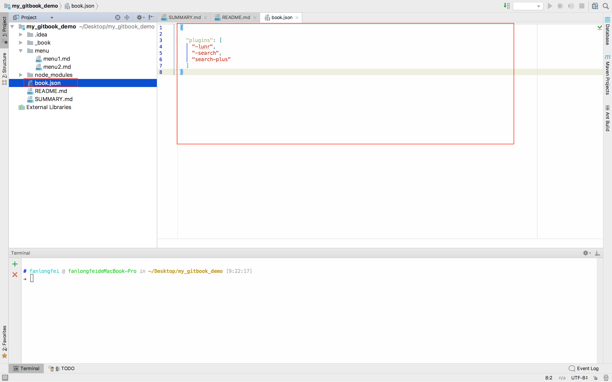

> 未安装插件启动报错

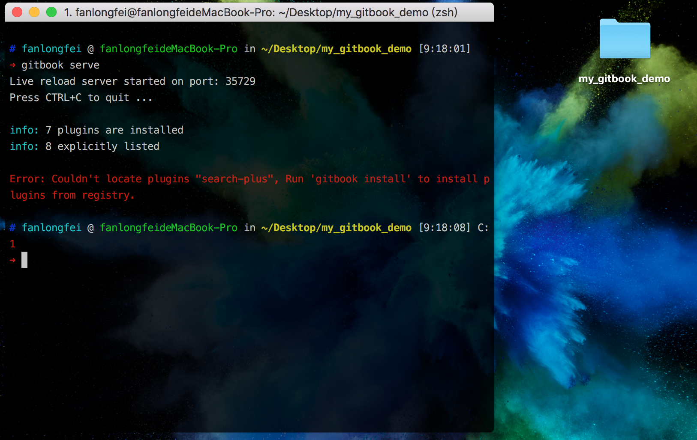

> 2.安装插件

```bash
$ gitbook install
```

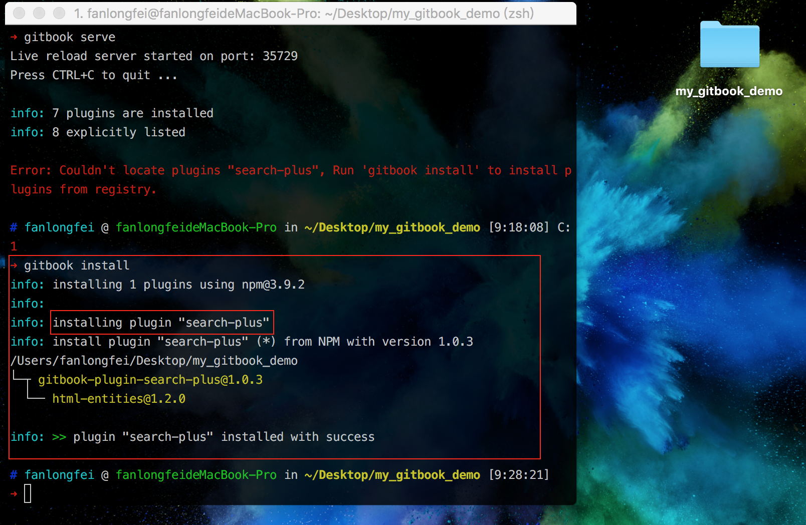

**
安装插件后会GitBook项目中会生成一个「node_modules」目录，里面是安装插件的生成文件
**

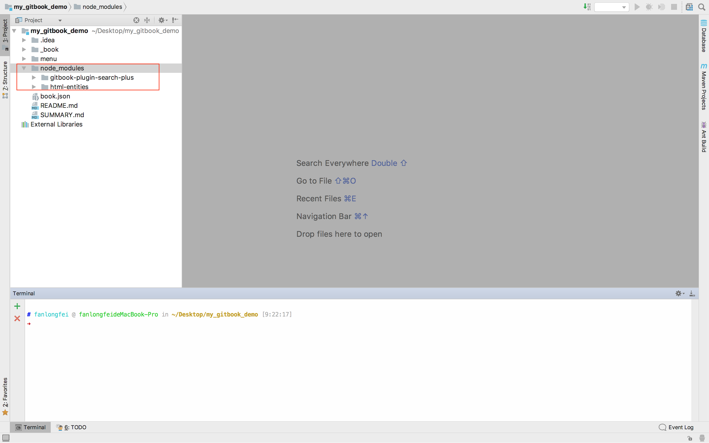

> 3.启动项目，查看插件是否生效，配置生效，已经支持高亮显示

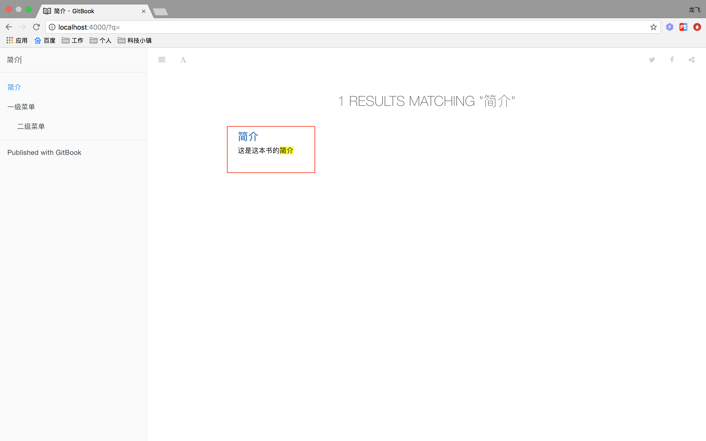

## 后台启动GitBook服务

**
后台启动可以使用nohup进行启动也可以使用setsid进行启动，但是nohup启动的话不是特别稳定，推荐使用setsid进行GitBook的后台启动
**

```bash
$ setsid gitbook serve
或
$ nohup gitbook serve &
```

## 使用GitBook生成的HTML进行访问

**
使用GitBook可以通过GitBook的服务进行访问，也就是通过服务的方式（IP+端口号），也可以直接访问GitBook生成的HTML，在启动GitBook
服务的时候GitBook项目中会生成「_book」文件夹，至于会生成「_book」的原因是在执行$gitbook serve 的时候，GitBook帮我们执行了
$gitbook build 命令
**

> 删除原来的「_book」文件

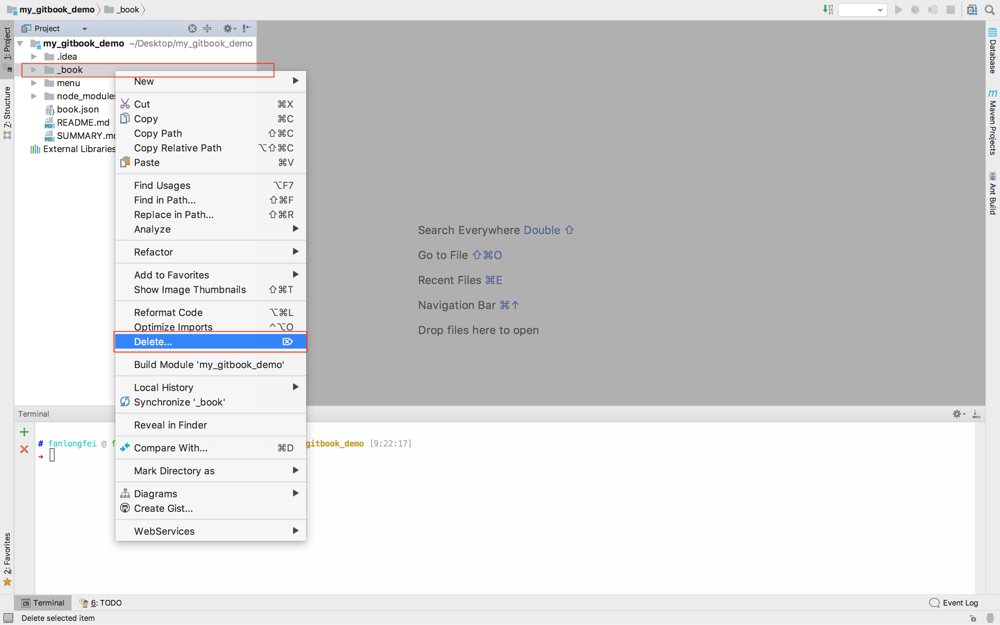

> 生成新的「_book」GitBook的HTML静态文件

```bash
$ gitbook build
```
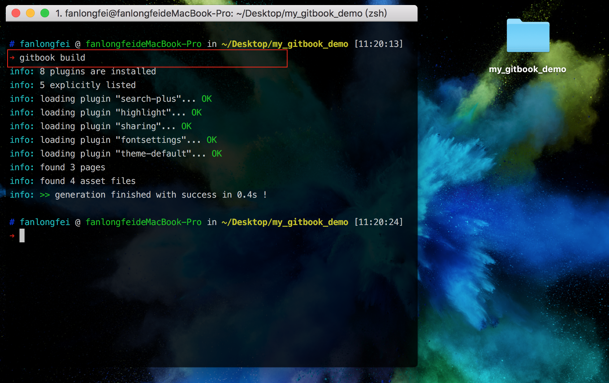

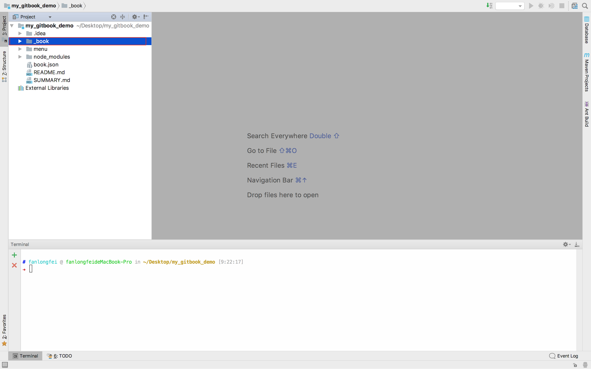

**
直接访问生成的静态文件就可以了，和访问服务的效果是一样的，但是会出现一个很严重的问题，在本地打开
index.html页面后点击左侧的菜单没有任何反应！！！根本不能跳转！！！但是如果将静态文件用Nginx做
反向代理的话是可以的 /(ㄒoㄒ)/~~ 在网上找了一下原因，据说是因为GitBook官方在3.0.0以后的静态HTML
都不支持跳转了，也就是说想生成正常可使用的GitBook的HTML得使用以前的版本生成HTML，我们在执行$gitbook build
的时候指定GitBook的版本号即可（$gitbook build --gitbook=2.6.7），如果指定的版本号不存在，GitBook
会自动安装我们指定的版本，但是，根本不好使，不知道是不是我的问题，我在自己的MacBook Pro上以及自己的服务器上都试了一下，
在执行$gitbook build --gitbook=2.6.7的时候会报NodeJs的错误，然后网上的资料显示需要对Node进行降级，
我试了，很可惜，然并卵。。我的Node都是从官网上下载的，GitBook也是使用npm进行安装的，这个算是一个遗留问题吧，MMP(ㄒoㄒ)/~~
**

> 从本地打开生成的HTML，左侧菜单不会跳转

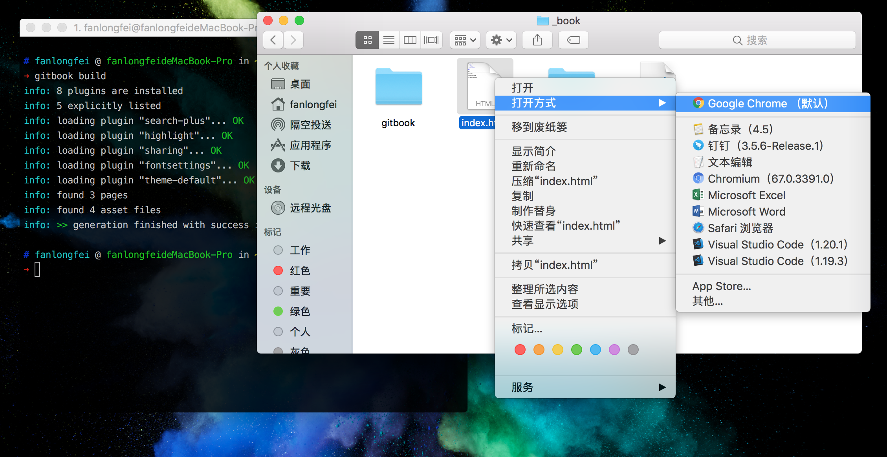

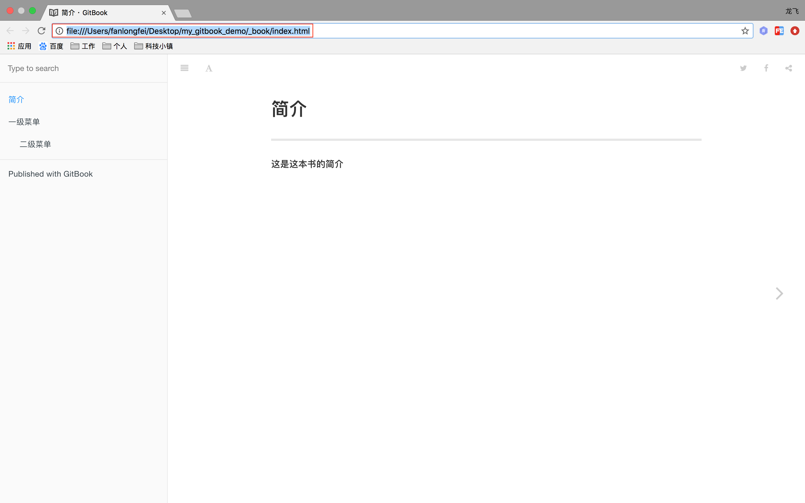

> 将Build生成的HTML使用Nginx反向代理之后左侧的菜单是可以点击跳转的

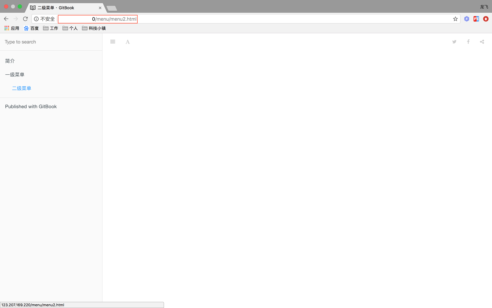