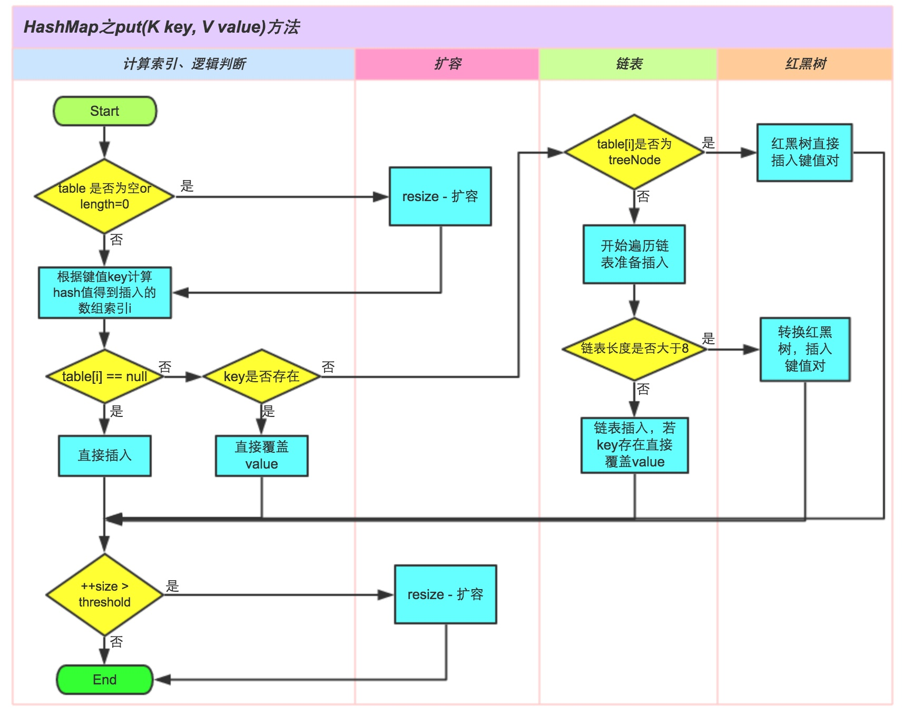

# HashMap

---

## 概述：

* **HashMap继承AbstractMap，实现了Map<K,V>, Cloneable, Serializable等接口**

* **HashMap的键和值对均可以为空，HashMap是无序的，键是不可以重复的，并且HashMap是非线程安全的**

* **HashMap1.8之前的底层结构是数组加链表，1.8之后引入了红黑树，在链表长度超过默认值8的时候，链表将转换为红黑树**

* **HashMap中 Node[] table 的初始化长度是16，这个结果是通过负载因子（默认值是0.75）计算出来的，如果在给HashMap赋值
的时候超过这个数量则会进行扩容扩容后的HashMap的长度是之前的两倍**

* **在并发多线程的场景中使用HashMap可能会造成死锁**

## put方法的逻辑

1. 如果HashMap未被初始话，则进行初始化

2. 对Key进行求Hash值，然后计算下标

3. 如果没有碰撞，直接放入桶中

4. 发生碰撞，以链表的形式链接到链表的后面

5. 如果链表长度超过阈值，将链表转换成红黑树

6. 如果长度降低于阈值，将红黑树转换成链表

7. 如果节点存在则替换旧值

8. 如果桶满了，进行重新扩容

## 网络资源:

* **知乎：**[Java 8系列之重新认识HashMap](https://www.zhihu.com/search?type=content&q=HashMap)