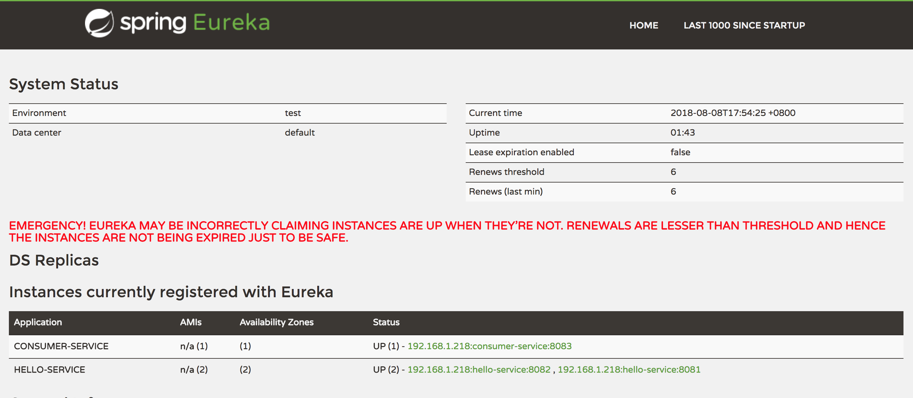

# SpringCloudEureka

---

## 服务治理

**为了解决微服务架构中的服务实例维护问题，产生了大量的服务治理框架和产品，这些框架和产品的实现都围绕着**
**服务注册与服务发现机制来完成对微服务应用实例的自动化管理**

* **服务注册：在服务治理框架中，通常都会构建一个注册中心，每个服务单元向注册中心登记自己提供的服务，当这些**
**进程均启动，并向注册中心注册自己的服务之后，注册中心就会维护类似下面的一个服务清单。服务注册中心还需要以心跳**
**的方式去监测清单中的服务是否可用，若不可用需要从服务清单中剔除，达到排除故障服务的效果**

* **服务发现：服务间的调用不在通过指定具体的实例地址来实现，而是通过向服务名发起请求条用实现。服务调用方在调用**
**服务提供方接口的时候，并不知道具体的服务实例位置，调用方需要向服务注册中心咨询服务，并获取所有服务的实例清单，**
**以实现对具体服务实例的访问。调用方如果可以获取多个服务实例的位置，会以某种轮询策略取出一个位置来进行服务调用，也就是客户端负载均衡**

## 搭建服务注册中心

* **通过```@EnableEurekaServer```注解启动一个服务注册中心提供给其他应用进行对话，在SpringBoot应用中添加这个注解开启此功能**

```java
@EnableEurekaServer
@SpringBootApplication
public class EurekaServerApplication {

	public static void main(String[] args) {
		SpringApplication.run(EurekaServerApplication.class, args);
	}
}
```

* **在默认设置下，该服务注册中心也会将自己作为客户端来尝试注册它自己，所以我们需要禁用它的客户端注册行为**

    1. ```eureka.client.register-with-eureka=false```：由于该应用为注册中心，所以设置为false，代表不向注册中心注册自己
    
    2. ```eureka.client.fetch-registry=false```：由于注册中心的职责就是维护服务实例，它并不需要去检索服务，所以也设置为false

```properties
server.port=8080

eureka.instance.hostname=localhost
eureka.client.register-with-eureka=false
eureka.client.fetch-registry=false
eureka.client.serviceUrl.defaultZone=http://${eureka.instance.hostname}:${server.port}/eureka/
```

## 注册服务提供者

**将一个既有的SpringBoot应用加入Eureka的服务治理体系中**

* **通过```@EnableDiscoveryClient```注解，在SpringBoot应用中添加这个注解，将其作为一个微服务应用向服务注册中心发布自己**

```java
@EnableDiscoveryClient
@SpringBootApplication
public class ServiceOneApplication {

	public static void main(String[] args) {
		SpringApplication.run(ServiceOneApplication.class, args);
	}
}
```

* **在```application.properties```配置文件中，通过```spring.application.name```属性来为服务命名，在通过**
**```eureka.client.serviceUrl.defaultZone```属性来指定服务注册中心的地址**

```properties
spring.application.name=hello-service
server.port=8081

eureka.client.serviceUrl.defaultZone=http://localhost:8080/eureka/
```

## 服务发现与消费

**在拥有了服务注册中心和服务提供者之后，构建服务消费者，它有两个目标，发现服务以及消费服务。服务发现的任务**
**由Eureka的客户端完成，而消费的任务由Ribbon完成。Ribbon是一个基于HTTP和TCP的客户端负载均衡器。**

* **创建消费服务，同样通过```@EnableDiscoveryClient```注解，在SpringBoot应用中添加这个注解，将其作为一个微服务应用向服务注册中心发布自己，**
**并且，在主类中创建RestTemplate的SpringBean实例，通过```@LoadBalanced```注解开启客户端负载均衡**

```java
@EnableDiscoveryClient
@SpringBootApplication
public class RibbonConsumerApplication {

	public static void main(String[] args) {
		SpringApplication.run(RibbonConsumerApplication.class, args);
	}

	@Bean
	@LoadBalanced
	RestTemplate restTemplate(){

		return new RestTemplate();
	}
}
```

* **同样，在```application.properties```配置文件中，通过```spring.application.name```属性来为服务命名，在通过**
**```eureka.client.serviceUrl.defaultZone```属性来指定服务注册中心的地址，注意端口号，不能与之前启动的应用端口冲突**

```properties
spring.application.name=consumer-service
server.port=8083

eureka.client.serviceUrl.defaultZone=http://localhost:8080/eureka/
```

* **在服务提供者中编写Controller方法，在服务消费者中使用RestTemplate进行服务消费**

>服务提供方

```java
@RestController
public class HelloController {

    private final Logger logger = Logger.getLogger(getClass());

    @Autowired
    private DiscoveryClient client;

    @RequestMapping(value = "/hello", method = RequestMethod.GET)
    public String index(){

        ServiceInstance instance = client.getLocalServiceInstance();

        logger.info("/hello, host:" + instance.getHost() + ", service_id:" + instance.getServiceId());

        return "Hello World";
    }
}
```

>服务消费方

```java
@RestController
public class ConsumerController {

    @Autowired
    private RestTemplate restTemplate;

    @RequestMapping(value = "/ribbon-consumer", method = RequestMethod.GET)
    public String helloConsumer(){

        return restTemplate.getForEntity("http://hello-service/hello", String.class).getBody();
    }
}
```

* **为了实验Ribbon的客户端负载均衡功能，将提供服务的SpringBoot应用程序用户不同的端口号进行启动，我们在注册中心中可以看到**
**两个不同端口号的相同服务，此时，消费服务进行服务消费时会根据服务名称进行服务消费，当发现多个相同名称服务实例时，Ribbon会进行轮询访问**

