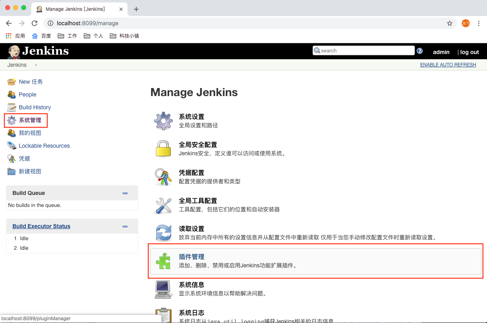
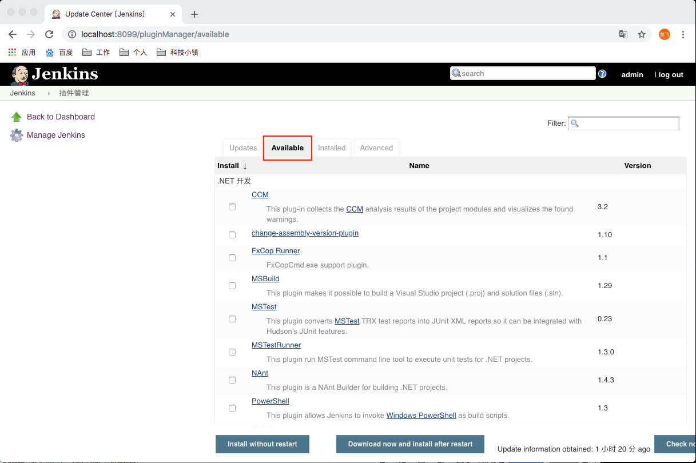
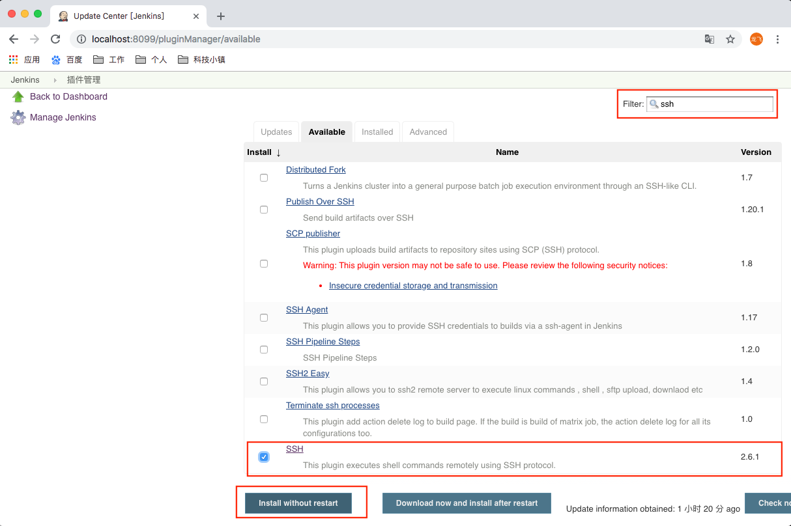
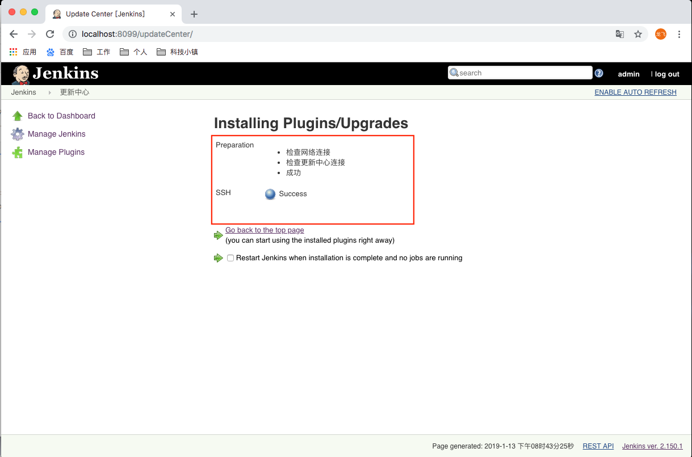

# Jenkins插件安装

---

## 在使用Jenkins时，有很多提供了便利的插件，可以使用这些插件进行更方便的配置

> 进入【系统管理中】的【插件管理】

* Updates中是可以进行更新的插件
* Available中是可用的插件
* Installed中是已经安装的插件
* Advanced是插件的高级选项（设置）

**可以在Available进行在线的插件安装，通过右上角的Filter搜索框进行关键字过滤，进行在线下载；
在Advanced中可以配置插件的代理、上传已经下载的插件、配置更新插件的地址**

## 使用Jenkins在线安装

* 点击Available

> 实例：下载SSH插件

* 通过关键字过滤将搜索出来的插件进行下载，下载后等待提示下载完成，即可使用

