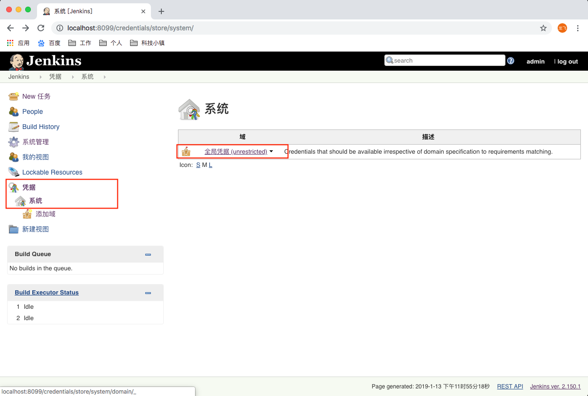

# Jenkins GitHub

---

## 使用Jenkins+GitHup进行【CI/CD】，手动触发

**使用Jenkins并且使用GitHub作为项目托管平台，当项目需要构建时，使用Jenkins进行项目自动化构建以及部署**

1.环境准备

* Jenkins服务器（电脑或远程服务器），安装Jenkins **【[-> Jenkins安装](/jenkins/jenkins2.md)】**

* 项目部署的远程服务器环境（阿里云、腾讯云、网易云等云主机或物理机）

* Jenkins服务器需要安装JAVA环境（建议1.8及以上）**【[-> Jdk安装](/java/jdk/jdk1.md)】**、
Git环境 **【[-> Git安装](/git/git2.md)】**、Gradle **【[-> Gradle安装](/gradle/gradle1.md)】**（或Maven）环境

* 远程服务器环境中需要安装JAVA环境

2.准备一个简单的SpringBoot项目，能进行接口访问即可

> 现有项目在GitHub上，可以直接下载或Fork到你们的GitHub上

* 项目地址：[https://github.com/fanlongfei0212/jenkins](https://github.com/fanlongfei0212/jenkins)

3.创建持续构建任务

**整个构建任务的思路是在Jenkins上创建一个持续构建、部署的任务，在这个任务中，通过手动触发任务将GitHub上的代码clone
到Jenkins工作空间中，在Jenkins的工作空间进行项目的打包，然后通过SSH上传到目标服务器中，也就是将项目部署到服务器上，
全程的打包、上传、杀掉上次的进程、重新启动服务全都是通过Jenkins的任务自动化进行的**

* 安装SSH插件

**编辑任务时，在需要对目标服务器的进行远程Shell脚本命令时会用到【[ Jenkins安装插件 -> 使用Jenkins在线安装 ](jenkins3.md)】**

* 添加GitHub凭据

**添加对GitHub访问的用户名密码;点击Jenkins中的【凭据 -> 系统 -> 全局凭据 -> 添加凭据】，输入你的用户信息，保存**




* 添加远程服务器凭据

**添加对项目部署服务器访问的用户名密码;点击Jenkins中的【凭据 -> 系统 -> 全局凭据 -> 添加凭据】，输入你的用户信息，
保存;**


**然后到【系统关系 -> 系统设置】中找到SSH remote hosts，设置SSH插件的信息，填写IP地址、端口、以及添加腾讯云的全局
用户凭证，点击【Check connection】，如果返回Successfull connection，表示链接远程服务器成功，点击系统设置中【Save】
进行保存**


**除了需要进行对远程服务器的登录信息凭据添加以外，还需要将Jenkins服务器（电脑）中的秘钥写入到远程服务器中的authorized_keys
文件中，做服务器间的免密码文件传输使用**


* 点击创建任务，填写任务名称，选择【构建一个自由风格的项目】


* 填写任务描述、填写项目代码来源、编写Jenkins所在的服务器（电脑）需要执行的Shell、编写远程服务器需要执行的Shell

**在Description中填写任务描述**


**到GitHub上找到自己的项目，复制项目的Clone地址**


**在代码来源中选择Git，粘贴复制来的项目Clone地址，点击【Credentials】选项的【Add】，选择添加的全局GitHub凭据
Git的分支默认为Master分支，可以根据实际情况进行修改**


**编写需要在Jenkins服务所执行的Shell;点击【Build】中的【Add build step】选择【执行 shell】，在Command中编
写Shell，Shell中使用Gradle命令进行项目构建，也可以使用Maven命令进行构建，根据具体实际情况**


> 针对Jenkins服务（电脑）的Shell脚本

```zsh
#!/bin/zsh

#在master节点服务中重新构建jar包
gradle clean build -x test

cd build/libs/

mv *.jar jenkins.jar

#上传jar包，待上传完毕之后

echo "开始上传文件....."

scp *.jar root@${ip地址}:/WorkSpace/Jenkins/temporary/

if [ $? -eq 0 ]; then

    echo "上传成功...."
else 

	echo "上传失败...."

fi
```

**编写需要在远程服务器执行的Shell;点击【Build】中的【Add build step】选择【Execute shell script on remote host using ssh】，
在【SSH site】中选择添加的远程服务器全局凭据，在Command中编写Shell，勾选【Hide command from console output】可以隐藏对远程服务
器编写的脚本，不在任务构建日志中输出，具体根据实际情况;点击Save，进行保存**


> 针对远程项目部署服务的Shell脚本

```bash
source /etc/profile

if [ -n "$(netstat -tlnp|grep 8088 | awk '{print $7}' | awk -F / '{print $1}')" ]; then
kill -9 $(netstat -tlnp|grep 8088 | awk '{print $7}' | awk -F / '{print $1}')
rm -rf /WorkSpace/Jenkins/jenkins.jar
mv /WorkSpace/Jenkins/temporary/jenkins.jar /WorkSpace/Jenkins/
cd /WorkSpace/Jenkins/
nohup java -jar *.jar >nohup.out 2>&1 &
else
rm -rf /WorkSpace/Jenkins/jenkins.jar
mv /WorkSpace/Jenkins/temporary/jenkins.jar /WorkSpace/Jenkins/
cd /WorkSpace/Jenkins/
nohup java -jar *.jar >nohup.out 2>&1 &
fi
```

* 进行任务构建


* 查看任务构建日志，成功后访问服务器远程项目，并且登录远程服务器进行项目日志查看，进行验证

**构建日志显示SUCCESS表示构建成功**


**访问项目接口，项目中默认【/】请求也会返回请求结果**


**登录服务器查看项目日志，再次确定项目启动成功**

