# 基本配置

---

## 管理员和运营者设置

>在日常使用或者工作中，我们在进行微信公众号的开发时，为了便于授权，一般需要进行「运营者」的设置

1.从左侧菜单「设置」中点击「安全中心」进入安全中心设置

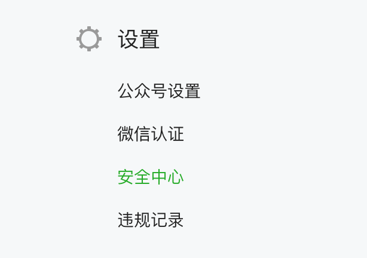

2.点击「管理员和运营者设置」

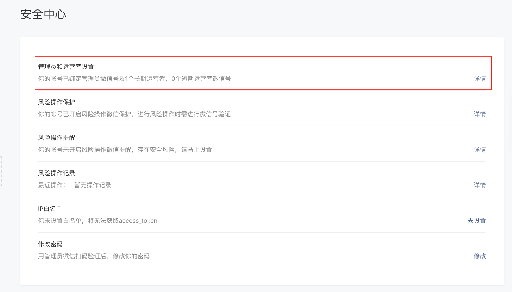

>微信运营者绑定有数量限制，最多25个，页面上有提示

3.点击「绑定运营者微信号」，进入绑定运营者操作页面

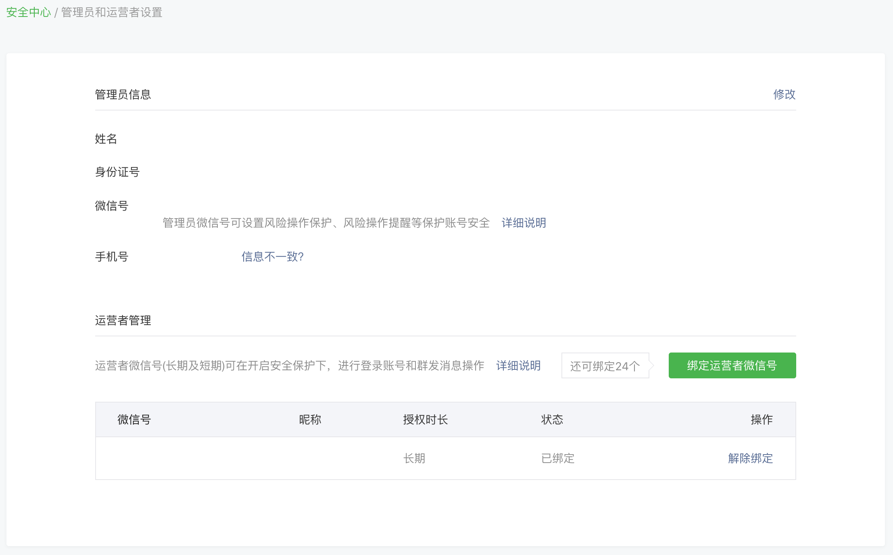

>在绑定运营者之前需要关注此公众号，长期运营者端权限要比短期运营者权限高

4.选择「长期」，输入微信号，点击「邀请绑定」，此时需要管理员进行扫码验证，管理员验证通过后，会收到公众号的运营者绑定邀请消息推送，接受邀请

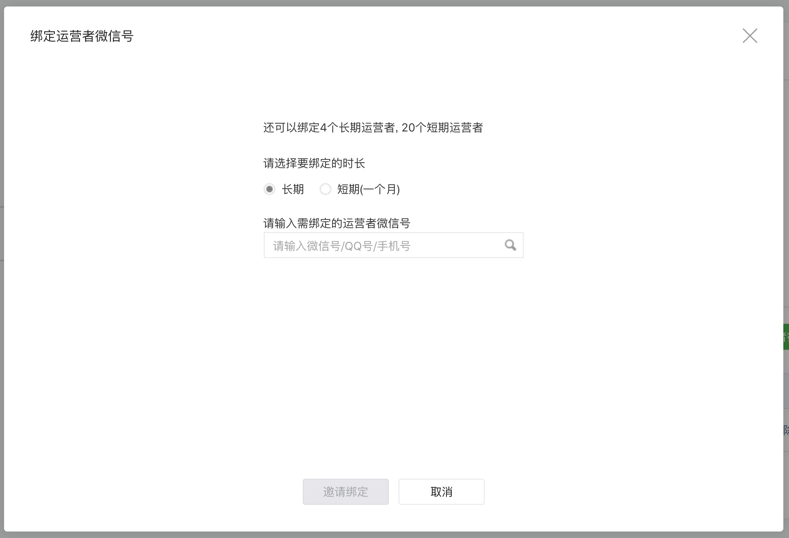

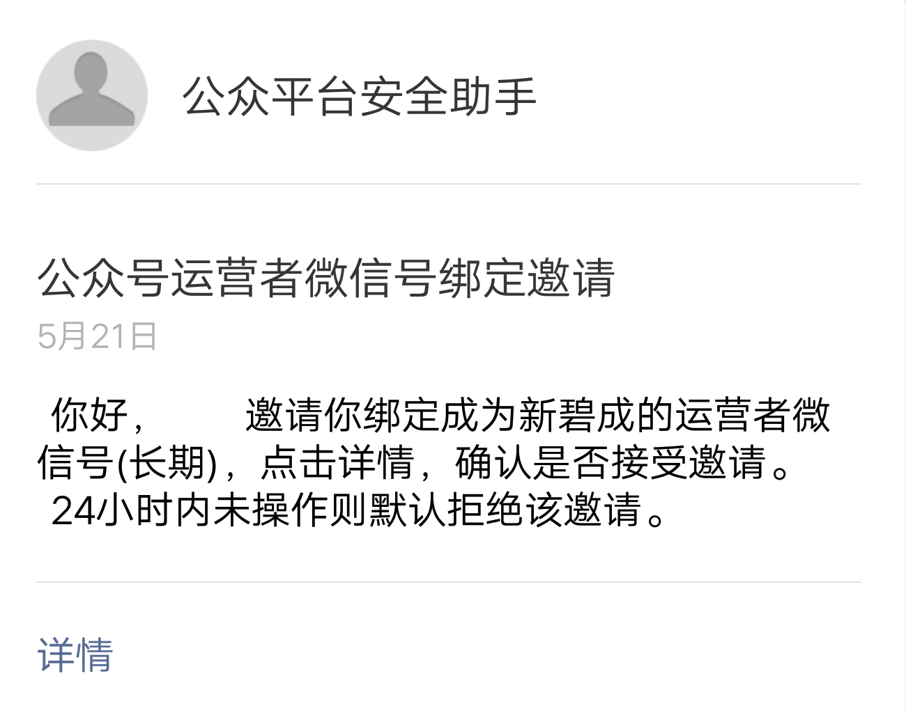

## AppSecret配置

>微信的接口调用需要使用AppId以及AppSecret

1.从左侧菜单「开发」中点击「基本配置」进入基本配置

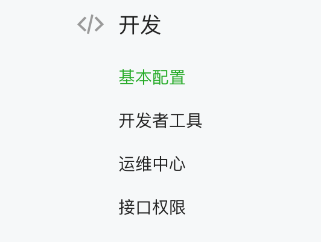

2.点击重置（我已经设置过AppSecret，第一次应该是启用），启用/重置 后需要管理员进行扫码验证，然后输入微信公众号密码进行密码验证

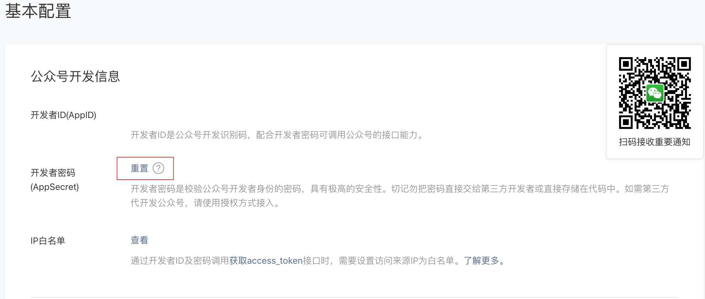

>生成AppSecret之后，微信公众平台不会再保存和显示AppSecret

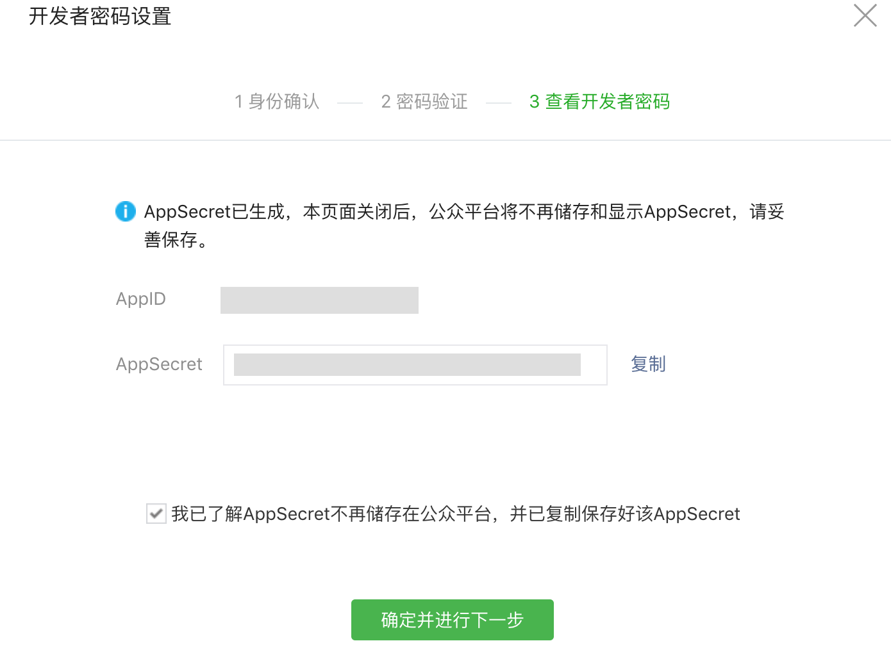

## 设置IP白名单

**
通过开发者ID及密码调用获取access_token接口时，需要设置访问来源IP为白名单。一般都是将服务器的测试、正式公网IP地址进行白名单的添加
**

1.从左侧菜单「开发」中点击「基本配置」进入基本配置

2.点击查看

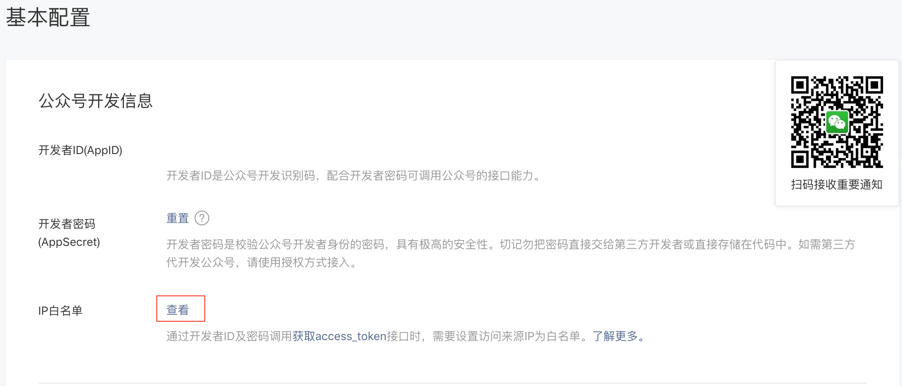

3.点击修改

>多个IP地址，进行换行，保存的时候需要进行管理员或长期运营者授权，此时，如果我们绑定了长期运营者，可以自己进行自己授权

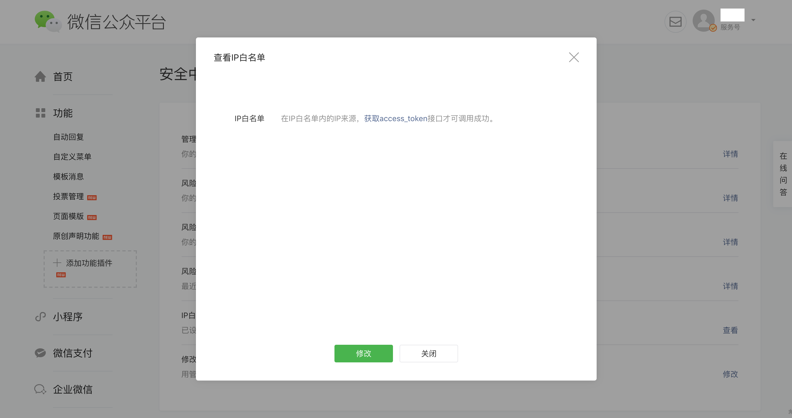

## 配置「业务域名」、「JS接口安全域名」、「网页授权域名」

**
设置业务域名后，在微信内访问该域名下页面时，不会被重新排版。用户在该域名上进行输入时，不会出现防诈骗等提示
**

**
设置JS接口安全域名后，公众号开发者可在该域名下调用微信开放的JS接口（微信JsSdk）
**

**
设置网页授权域名后，用户在网页授权页同意授权给公众号后，微信会将授权数据传给一个回调页面
**

1.从左侧菜单「设置」中点击「公众号设置」进入公众号设置，点击「功能设置」

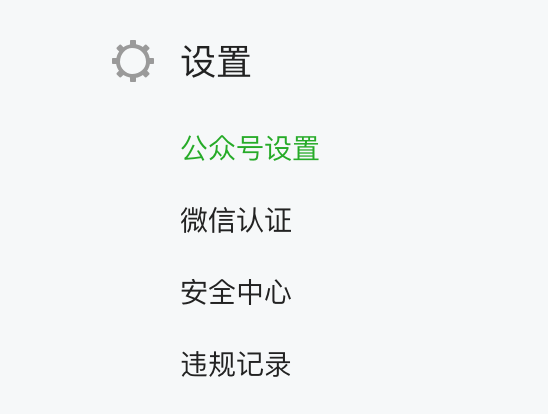

2.设置业务域名

>每个自然月最多修改3次

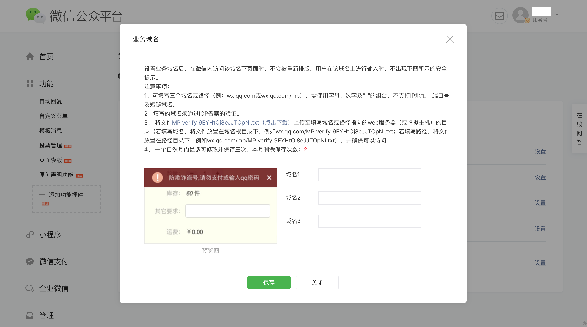

3.设置JS接口安全域名

>每个自然月最多修改3次

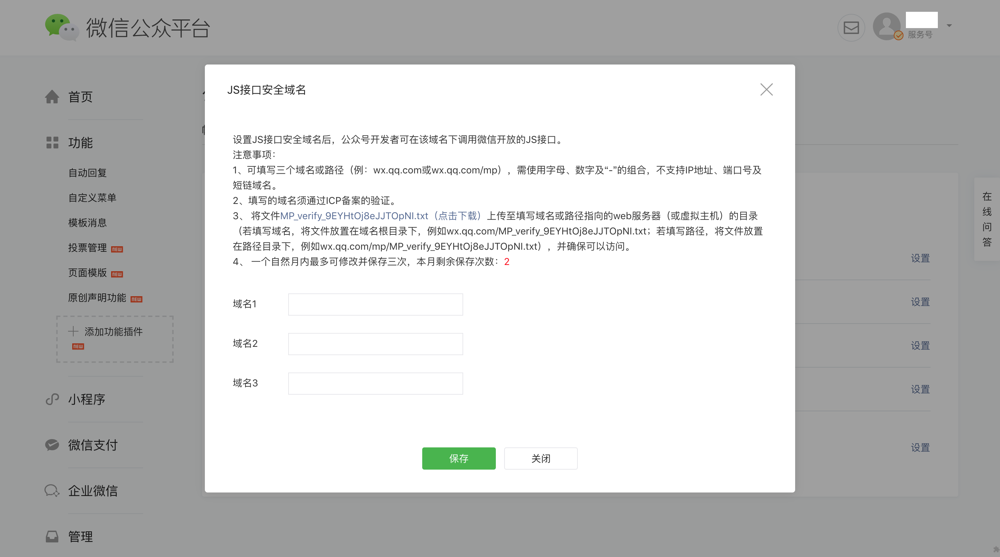

4.设置网页授权域名

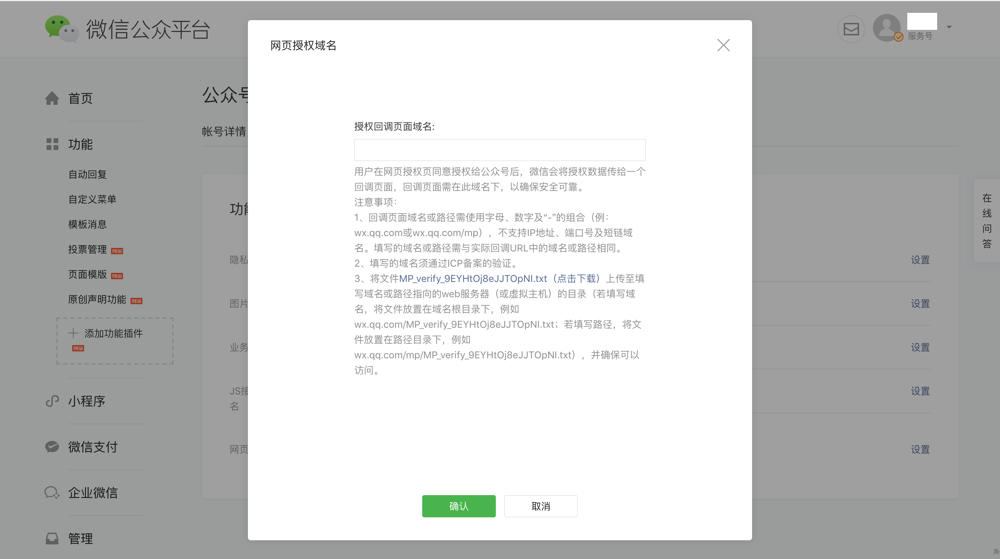