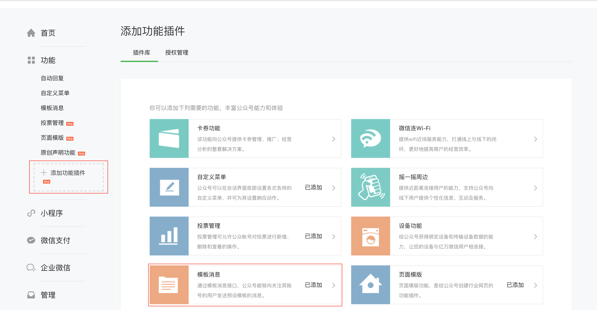
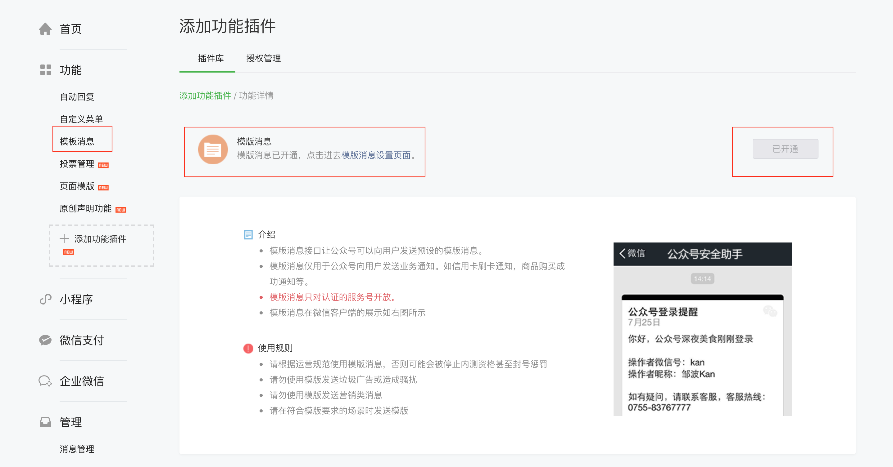
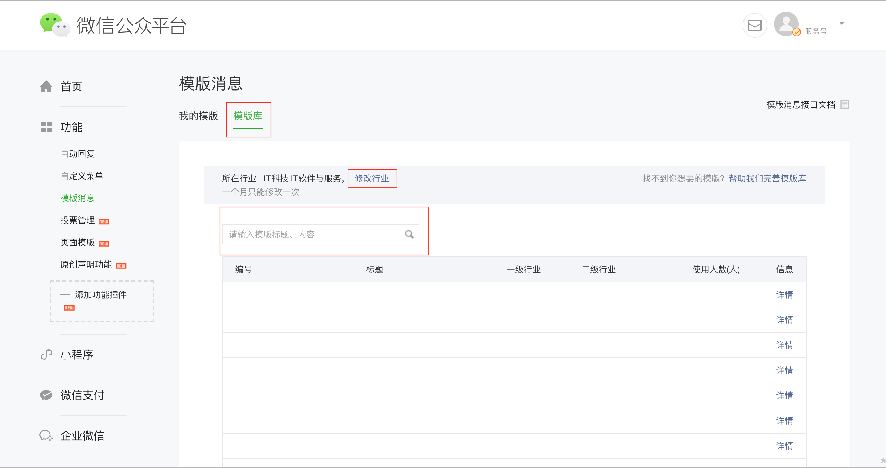

# 模板消息

---

## 添加模板消息

>新的公众号是没有模板消息的，需要在「添加功能插件」中添加模板消息插件

1.从左侧菜单「功能」中点击「添加功能插件」进入插件库

>这是已经添加过的，所以显示是已添加，没有添加过的点进模板消息进行申请

>申请时需要写申请理由、设置所属行业，大概半天左右就会申请通过，通过后可以进行使用

2.开通后

## 添加模板消息

1.从左侧菜单「功能」中点击「模板消息」进入模板消息，可查看「我的模板」以及「模板库」

2.从模板库中添加模板，可以在模板库中修改行业，以及自定义消息模板

>'我的模板'最多存在25个

>行业每个月只能修改一次

